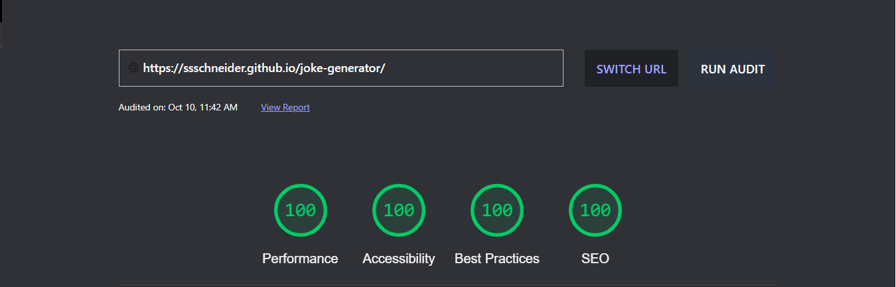
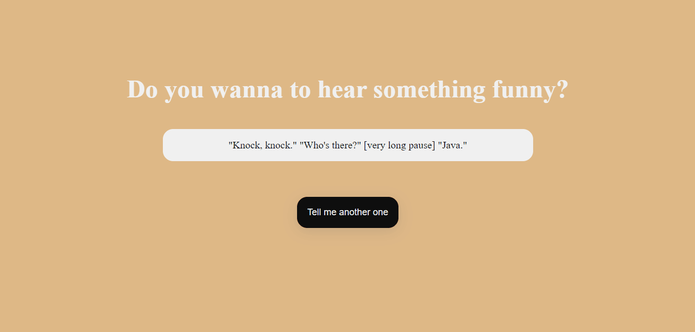
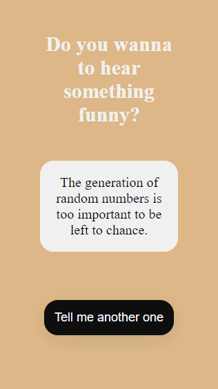

# Joke API

### Meu primeiro projeto consumindo API's! 🤯

--------------

## Sobre o projeto

Um projeto pessoas consumindo a [Joke API](https://v2.jokeapi.dev/), uma API que gera piadas de acordo com os temas selecionados em sua língua de preferência.

--------------

## Tecnologias Usadas

Para completar o desafio usei:
 - HTML
 - CSS
 - Javascript
 - Tags Semânticas
 - Consumo de API
 
--------------

## Pontuação no Lighthouse

Sempre buscando garantir a melhor experiência possível ao usuário, o Joke Generator é o site de 100% de qualidade.

--------------

## O Projeto Rodando

#### Versão Desktop

#### Versão Mobile
