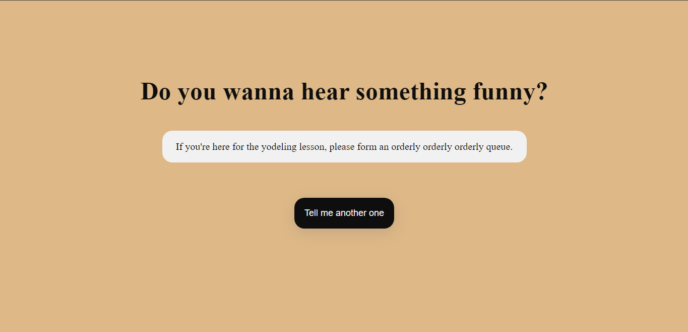
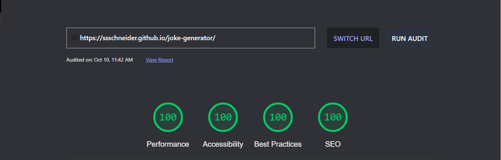

<h1 align="center"> Gerador de Piadas </h1>

Um projeto pessoas consumindo a Joke API, uma API que gera piadas de acordo com os temas selecionados em sua língua de preferência.  

  <a href="#-tecnologias">Tecnologias</a>&nbsp;&nbsp;&nbsp;|&nbsp;&nbsp;&nbsp;
  <a href="#-deploy">Deploy</a>&nbsp;&nbsp;&nbsp;|&nbsp;&nbsp;&nbsp;
  <a href="#-english-version">English Version</a>&nbsp;&nbsp;&nbsp;&nbsp;&nbsp;&nbsp;

  

## 🚀 Tecnologias

Esse projeto foi desenvolvido com as seguintes tecnologias:

- HTML e CSS
- JavaScript
- Consumo da API [Joke API](https://v2.jokeapi.dev/)
- Git e Github
- Figma

## 💯 Lighthouse

Sempre buscando garantir a melhor experiência possível ao usuário, o Joke Generator é o site de 100% de qualidade de acordo com o Lighthouse

  

## 💻 Deploy

> [Clique aqui para navegar para o projeto!](https://ssschneider.github.io/joke-generator/)
> 
## 🌎 English Version

Joke Generator is a project with the goal of generating jokes by using the JokeAPI. To do that, I've used:
- HTML, CSS, JS, JokeAPI, Git, Github and Figma

> You can check out the deploy by [clicking here](https://ssschneider.github.io/joke-generator/)

---
### Desenvolvido por Sarah Schneider 🖖